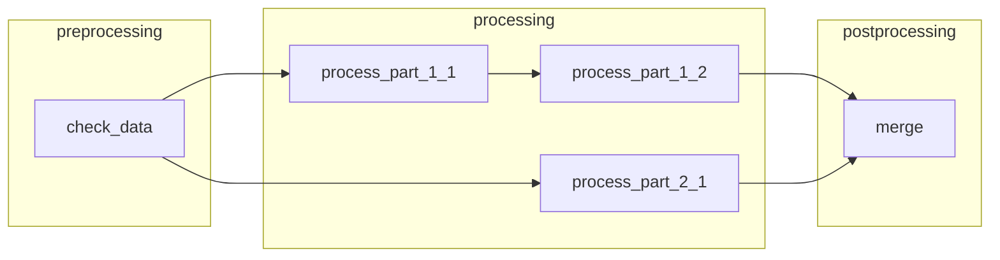

# WinFlow 2.0

WinFlow is a lightweight **EDA flow runner** for LSF clusters. You describe a design flow as JSON (stages, tasks, jobs, and file dependencies); WinFlow submits jobs with `bsub`, polls status with `bjobs`, validates inputs/outputs, and optionally visualizes progress in a Tkinter GUI.

## Features

- **Declarative flows** — JSON config with stages, tasks, jobs, inputs, outputs, queue, and CPU count
- **Dependency tracking** — job DAG inferred from shared input/output paths
- **LSF integration** — `bsub` / `bjobs` / `bkill` with per-job logs under `log/`
- **CLI runner** — `flow_runner_core.py` for headless execution
- **GUI** — DAG view, live status, log tailing, stop/rerun failed jobs

## Requirements


| Component   | Notes                                                       |
| ----------- | ----------------------------------------------------------- |
| Python 3.9+ | Standard library only (no pip packages)                     |
| LSF         | `bsub`, `bjobs`, `bkill` on `PATH`                          |
| Tkinter     | For GUI (`flow_runner_gui.py`); usually bundled with Python |
| C shell     | Example scripts use `#!/bin/csh`                            |


Run all commands from the **repository root** so relative paths in `flow.json` resolve correctly.

## Quick start

### 1. Configure your queue

Edit `flow.json` (or copy from `flow_example.json`) and set each job's `"queue"` to an LSF queue available on your cluster (the bundled example uses `tpdsd1`).

### 2. Run from the command line

```bash
python flow_runner_core.py flow.json
```

Default config path is `flow.json` when no argument is given.

### 3. Run with the GUI

```bash
python flow_runner_gui.py
```

Load a config (default: `flow.json`), inspect the job DAG, then click **Run Flow**.

## Repository layout

```
WinFlow2.0/
├── flow_runner_core.py    # Core engine + CLI entry point
├── flow_runner_gui.py     # Tkinter GUI
├── flow.json              # Active flow config (default for runners)
├── flow_example.json      # Documented example template
├── example_flow/          # Sample scripts and input for the demo flow
│   ├── input.txt
│   ├── s1_t1_j1.sh        # preprocessing
│   ├── s2_t1_j1.sh        # processing (task 1, job 1)
│   ├── s2_t1_j2.sh        # processing (task 1, job 2)
│   ├── s2_t2_j1.sh        # processing (task 2)
│   └── s3_t1_j1.sh        # postprocessing (merge)
├── log/                   # Per-job LSF stdout/stderr (created at runtime)
└── logs/                  # Flow-runner session logs (created at runtime)
```

## Execution model

Understanding how WinFlow schedules work helps when authoring flows:


| Level                     | Runs         | Notes                                            |
| ------------------------- | ------------ | ------------------------------------------------ |
| **Stage**                 | Sequentially | Stage *N+1* starts only after stage *N* finishes |
| **Task** (within a stage) | In parallel  | One thread per task                              |
| **Job** (within a task)   | Sequentially | Jobs run in list order                           |


The GUI builds a **job-level DAG** from `inputs` / `outputs`:

- Jobs in the same task are chained in order.
- A job that lists a file as `input` depends on whichever job last produced that file.




## Flow configuration

Top-level keys:


| Key             | Required | Default | Description                   |
| --------------- | -------- | ------- | ----------------------------- |
| `flow_name`     | yes      | —       | Display name for the flow     |
| `stages`        | yes      | —       | Ordered list of stages        |
| `poll_interval` | no       | `10`    | Seconds between `bjobs` polls |


Each **stage** has `name` and `tasks`. Each **task** has `name` and `jobs`. Each **job** has:


| Key       | Required | Default | Description                                               |
| --------- | -------- | ------- | --------------------------------------------------------- |
| `name`    | yes      | —       | Template name (LSF job name gets a user/timestamp suffix) |
| `command` | yes      | —       | Shell command submitted to LSF                            |
| `inputs`  | yes      | —       | Paths that must exist before submission                   |
| `outputs` | yes      | —       | Paths that must exist after `DONE`                        |
| `queue`   | no       | `"all"` | LSF queue                                                 |
| `cpu`     | no       | `1`     | CPU count (`bsub -n`)                                     |


Example (abbreviated):

```json
{
  "flow_name": "example_flow",
  "poll_interval": 10,
  "stages": [
    {
      "name": "preprocessing",
      "tasks": [
        {
          "name": "validate_inputs",
          "jobs": [
            {
              "name": "check_data",
              "command": "./example_flow/s1_t1_j1.sh",
              "queue": "tpdsd1",
              "cpu": 1,
              "inputs": ["example_flow/input.txt"],
              "outputs": ["temp.txt"]
            }
          ]
        }
      ]
    }
  ]
}
```

See `flow_example.json` for the full three-stage demo.

## Bundled example flow

The `example_flow` pipeline demonstrates validation, parallel tasks, sequential jobs within a task, and a final merge:


| Stage          | Task            | Job              | What it does                                              |
| -------------- | --------------- | ---------------- | --------------------------------------------------------- |
| preprocessing  | validate_inputs | check_data       | Validates `input.txt`, writes `temp.txt`                  |
| processing     | task_1          | process_part_1_1 | Creates `output_1.txt`                                    |
| processing     | task_1          | process_part_1_2 | Appends to `output_1.txt` (runs after job 1 in same task) |
| processing     | task_2          | process_part_2_1 | Creates `output_2.txt` (runs parallel with task_1)        |
| postprocessing | merge_results   | merge            | Merges both outputs into `final_output.txt`               |


**task_1** and **task_2** run at the same time; jobs inside **task_1** run one after another.

To try it:

```bash
python flow_runner_core.py flow_example.json
```

Runtime artifacts (`temp.txt`, `output_*.txt`, `final_output.txt`) are created in the repo root. Re-run after deleting them, or use the GUI **Rerun** button after a failure.

## Logging


| Directory                          | Contents           |
| ---------------------------------- | ------------------ |
| `log/{user}_{job}_{timestamp}.log` | LSF stdout per job |
| `log/{user}_{job}_{timestamp}.err` | LSF stderr per job |
| `logs/flow_runner.log`             | CLI session log    |
| `logs/flow_YYYYMMDD_HHMMSS.log`    | GUI session log    |


The GUI **Clear Logs** button removes files under `log/` and `logs/`.

## GUI controls


| Control            | Action                                                      |
| ------------------ | ----------------------------------------------------------- |
| **Run Flow**       | Execute the loaded config from the beginning                |
| **Rerun**          | Resume from the first failed job, skipping completed jobs   |
| **Stop**           | `bkill` all tracked LSF jobs (retries every 15s until gone) |
| **Job node click** | Open detail dialog: inputs/outputs, timing, stop, validate  |
| **Job Log tab**    | Tail active job logs; select a job from the dropdown        |


## License

CC0 1.0 Universal — see [LICENSE](LICENSE).