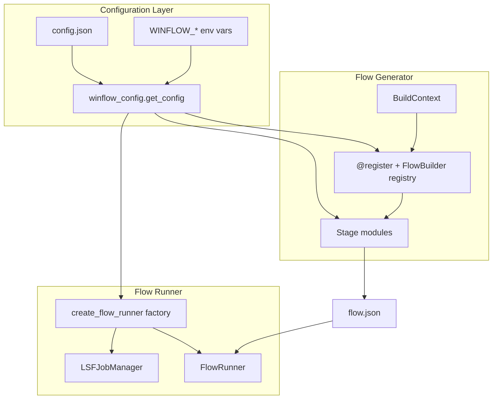

# WinFlow 2.0

WinFlow is a lightweight **EDA flow runner** for LSF clusters. You describe a design flow as JSON (stages, tasks, jobs, and file dependencies); WinFlow submits jobs with `bsub`, polls status with `bjobs`, validates inputs/outputs, and optionally visualizes progress in a Tkinter GUI.

A companion **flow generator** package builds `flow.json` from domain inputs (`setting.sh`, `block_stream.list`) for PV (physical verification) and APR (place-and-route) flows, with a visual editor to export runnable JSON.

## Features

- **Declarative flows** — JSON config with stages, tasks, jobs, inputs, outputs, queue, and CPU count
- **Centralized configuration** — site defaults in `config.json`, optional `WINFLOW_`* environment overrides
- **Flow generator** — CLI and GUI to build PV/APR flows from project settings
- **Dependency tracking** — job DAG inferred from shared input/output paths
- **LSF integration** — `bsub` / `bjobs` / `bkill` with per-job logs
- **CLI runner** — `flow_runner_core.py` for headless execution
- **Runner GUI** — DAG view, live status, log tailing, stop/rerun failed jobs
- **Generator GUI** — visual flow editor with Blank / PV / APR templates

## Requirements


| Component   | Notes                                   |
| ----------- | --------------------------------------- |
| Python 3.9+ | Standard library only (no pip packages) |
| LSF         | `bsub`, `bjobs`, `bkill` on `PATH`      |
| Tkinter     | For GUIs; usually bundled with Python   |
| C shell     | Example scripts use `#!/bin/csh`        |


Run all commands from the **repository root** so relative paths in `flow.json` resolve correctly.

## Quick start

### 1. Configure site defaults

Edit `config.json` at the project root. At minimum, set `runner.default_queue` and `generator.default_queue` to an LSF queue available on your cluster (the bundled default is `tpdsd1`).

```json
{
  "runner": {
    "default_queue": "your_queue",
    "poll_interval": 20
  },
  "generator": {
    "default_queue": "your_queue"
  }
}
```

You can also point to an alternate config file:

```bash
export WINFLOW_CONFIG=/path/to/my-site-config.json
```

### 2. Run from the command line

```bash
python flow_runner_core.py flow.json
```

When no argument is given, the default flow file from `config.json` (`runner.default_flow_file`, currently `flow.json`) is used.

### 3. Run with the unified GUI (recommended)

```bash
python winflow_gui.py
```

One window with **Runner** and **Generator** tabs. Build a flow in Generator, then click **Sync from Generator** (next to Browse on the Runner top bar) to load it and reset all job statuses (only while no jobs are running).

### 4. Run with the runner GUI only

```bash
python flow_runner_gui.py
```

Load a config, inspect the job DAG, then click **Run Flow**.

### 5. Generate a flow (CLI)

```bash
python -m flow_generator --flow pv --setting setting.sh --blocks block_stream.list -o flow.json
python -m flow_generator --list          # list registered flow types (pv, apr)
```

### 6. Generate a flow (GUI only)

```bash
python flow_generator_gui.py
```

Load a template (Blank, PV, or APR), edit jobs visually, then **Export flow.json**.

## Repository layout

```
WinFlow2.0/
├── config.json                 # Site-wide defaults (queue, paths, LSF, GUI)
├── winflow_config/             # Config loader and typed dataclasses
│   ├── models.py
│   └── loader.py
├── flow_runner_core.py         # Core engine + CLI entry point
├── flow_runner_gui.py          # Runner Tkinter GUI (standalone or tab)
├── winflow_gui.py              # Unified Runner + Generator notebook GUI
├── flow_generator.py           # Thin wrapper → flow_generator.cli
├── flow_generator_gui.py       # Visual flow editor (standalone or tab)
├── flow_graph.py               # Shared DAG layout (runner + generator GUIs)
├── flow.json                   # Active flow config (default for runners)
├── flow_generator/             # Flow generation package
│   ├── cli.py                  # Generator CLI
│   ├── core/                   # Registry, models, BuildContext, I/O
│   ├── flows/
│   │   ├── pv/                 # PV flow builder + stage modules
│   │   └── apr/                # APR flow builder
│   ├── gui/                    # FlowDocument, templates, graph layout, job nodes
│   ├── node/                   # Predefined Add-Job templates (*.json)
│   └── parsers/                # setting.sh and block_stream.list parsers
├── example_flow/               # Sample scripts for a minimal demo pipeline
├── log/                        # Per-job LSF stdout/stderr (created at runtime)
├── logs/                       # Flow-runner session logs (created at runtime)
└── tests/                      # Unit tests
```

## Configuration

WinFlow uses a **two-tier configuration model**:


| Tier              | Source                                         | Purpose                                                                                   |
| ----------------- | ---------------------------------------------- | ----------------------------------------------------------------------------------------- |
| **Site defaults** | `config.json` + `WINFLOW_`* env vars           | Queue names, paths, poll intervals, script names — values that change per cluster or site |
| **Per-design**    | `setting.sh`, `block_stream.list`, `flow.json` | Design-specific module names, flags, job commands, and file dependencies                  |


### Loading order

1. Built-in Python defaults in `winflow_config/models.py`
2. Values from `config.json` (merged recursively)
3. Environment variable overrides (see table below)

Access configuration in code:

```python
from winflow_config import get_config

cfg = get_config()
queue = cfg.runner.default_queue
poll  = cfg.runner.poll_interval
```

Reload after changing the config file:

```python
cfg = get_config(reload=True)
```

### `config.json` structure

#### `runner` — flow execution defaults


| Key                       | Default                | Description                                                                      |
| ------------------------- | ---------------------- | -------------------------------------------------------------------------------- |
| `default_flow_file`       | `flow.json`            | Default config path for CLI and runner GUI                                       |
| `session_log_dir`         | `logs`                 | Directory for session logs                                                       |
| `session_log_file`        | `logs/flow_runner.log` | CLI session log path                                                             |
| `job_log_dir`             | `log`                  | Per-job LSF stdout/stderr directory                                              |
| `poll_interval`           | `20`                   | Seconds between `bjobs` polls (also used when `flow.json` omits `poll_interval`) |
| `default_queue`           | `tpdsd1`               | LSF queue when a job has no `queue` field                                        |
| `default_cpu`             | `4`                    | CPU count when a job has no `cpu` field                                          |
| `logger_name`             | `FlowRunner`           | Python logger name                                                               |
| `kill_poll_ms`            | `15000`                | Milliseconds between kill-status checks in runner GUI                            |
| `kill_max_retries`        | `4`                    | Max kill attempts before giving up                                               |
| `log_tail_interval_sec`   | `0.5`                  | Log tail polling interval in runner GUI                                          |
| `thread_join_timeout_sec` | `1.0`                  | Thread join timeout for log tailer                                               |
| `log_viewer`              | `gvim`                 | External editor launched for job logs                                            |
| `auto_load_delay_ms`      | `150`                  | Delay before auto-loading config in runner GUI                                   |


#### `lsf` — LSF command configuration


| Key                         | Default         | Description                                |
| --------------------------- | --------------- | ------------------------------------------ |
| `bsub`                      | `bsub`          | Job submission command                     |
| `bjobs`                     | `bjobs`         | Status query command                       |
| `bkill`                     | `bkill`         | Job kill command                           |
| `bjobs_noheader`            | `true`          | Pass `-noheader` to `bjobs`                |
| `bjobs_output_field`        | `stat`          | Output field for `bjobs -o`                |
| `job_name_timestamp_format` | `%Y%m%d_%H%M%S` | `strftime` format for unique LSF job names |


#### `generator` — flow generator defaults


| Key                    | Default             | Description                                      |
| ---------------------- | ------------------- | ------------------------------------------------ |
| `default_flow_type`    | `pv`                | Default `--flow` argument for CLI                |
| `default_setting_file` | `setting.sh`        | Default path to csh settings file                |
| `default_blocks_file`  | `block_stream.list` | Default block list path                          |
| `default_output_file`  | `flow.json`         | Default output path                              |
| `poll_interval`        | `20`                | `poll_interval` written into generated flows     |
| `default_queue`        | `tpdsd1`            | Default queue for templates and new jobs         |
| `default_cpu`          | `4`                 | Default CPU for templates                        |
| `blank_flow_name`      | `custom_flow`       | Flow name for the Blank template                 |
| `new_job_cpu`          | `1`                 | CPU for manually added jobs in the generator GUI |


#### `pv` — physical verification flow


| Key                 | Description                                                                      |
| ------------------- | -------------------------------------------------------------------------------- |
| `flow_name`         | Generated flow name (`PV`)                                                       |
| `required_settings` | Keys required in `setting.sh`: `TOP_MODULE`, `MACHINE_QUEUE`, `MACHINE_CPU`      |
| `paths.laker_dir`   | Laker directory (default `../LakerBZ`; override via `LAKER_DIR` in `setting.sh`) |
| `paths.gds_dir`     | GDS directory (default `../GDS`; override via `GDS_DIR`)                         |
| `paths.flow_dir`    | Shell script directory (default `../flow`; override via `FLOW_DIR`)              |
| `paths.data_dir`    | Input data directory (default `../DATA`; override via `DATA_DIR`)                |
| `scripts.*`         | Shell script filenames used by PV stage builders                                 |
| `files.*`           | File patterns (`apr.gds.gz`, `DRC.rep`, etc.)                                    |
| `merge_flags`       | Maps `setting.sh` flags to merge scripts and GDS tags                            |


#### `apr` — place-and-route flow


| Key                     | Default                                              | Description                                           |
| ----------------------- | ---------------------------------------------------- | ----------------------------------------------------- |
| `flow_name`             | `APR`                                                | Generated flow name                                   |
| `stage_name`            | `APR`                                                | Stage name in output JSON                             |
| `task_name`             | `apr`                                                | Task name in output JSON                              |
| `run_stage_template`    | `./run_stage {job_name}`                             | Command template per job                              |
| `output_template`       | `{job_name}/DB/{job_name}.enc.dat`                   | Output path template                                  |
| `stages_before_current` | `01_floorplan`, `02_prects_opt`, `03_cts_concurrent` | APR stages always included                            |
| `current_stage`         | `04_postcts_opt`                                     | Included only when `APR_IS_CURRENT=1` in `setting.sh` |
| `stages_after_current`  | `05_route.tcl`, `06_postroute_opt`                   | Stages after CTS                                      |
| `default_queue`         | `tpdsd1`                                             | Fallback when `MACHINE_QUEUE` is absent               |
| `default_cpu`           | `4`                                                  | Fallback when `MACHINE_CPU` is absent                 |


#### `gui` — window geometry


| Key                     | Default    | Description                     |
| ----------------------- | ---------- | ------------------------------- |
| `generator_window_size` | `1280x800` | Generator GUI initial size      |
| `generator_window_min`  | `960x640`  | Generator GUI minimum size      |
| `runner_window_size`    | `1280x820` | Runner GUI initial size         |
| `sidebar_min_width`     | `220`      | Generator sidebar minimum width |


### Environment variable overrides


| Variable                          | Config path               | Type                            |
| --------------------------------- | ------------------------- | ------------------------------- |
| `WINFLOW_CONFIG`                  | *(config file path)*      | path to alternate `config.json` |
| `WINFLOW_RUNNER_DEFAULT_QUEUE`    | `runner.default_queue`    | string                          |
| `WINFLOW_RUNNER_POLL_INTERVAL`    | `runner.poll_interval`    | int                             |
| `WINFLOW_RUNNER_DEFAULT_CPU`      | `runner.default_cpu`      | int                             |
| `WINFLOW_RUNNER_JOB_LOG_DIR`      | `runner.job_log_dir`      | string                          |
| `WINFLOW_RUNNER_SESSION_LOG_DIR`  | `runner.session_log_dir`  | string                          |
| `WINFLOW_GENERATOR_DEFAULT_QUEUE` | `generator.default_queue` | string                          |
| `WINFLOW_GENERATOR_POLL_INTERVAL` | `generator.poll_interval` | int                             |
| `WINFLOW_GENERATOR_DEFAULT_CPU`   | `generator.default_cpu`   | int                             |
| `WINFLOW_PV_LAKER_DIR`            | `pv.paths.laker_dir`      | string                          |
| `WINFLOW_PV_GDS_DIR`              | `pv.paths.gds_dir`        | string                          |
| `WINFLOW_PV_FLOW_DIR`             | `pv.paths.flow_dir`       | string                          |
| `WINFLOW_PV_DATA_DIR`             | `pv.paths.data_dir`       | string                          |
| `WINFLOW_APR_DEFAULT_QUEUE`       | `apr.default_queue`       | string                          |
| `WINFLOW_APR_DEFAULT_CPU`         | `apr.default_cpu`         | string                          |


Example:

```bash
export WINFLOW_RUNNER_DEFAULT_QUEUE=short
export WINFLOW_PV_DATA_DIR=/proj/chip/DATA
python flow_runner_core.py
```

## Architecture

WinFlow is organized into three layers: configuration, flow generation, and flow execution.




### Design patterns


| Pattern                 | Where                                           | Purpose                                                                                             |
| ----------------------- | ----------------------------------------------- | --------------------------------------------------------------------------------------------------- |
| **Registry + Strategy** | `flow_generator/core/registry.py`               | `@register("pv")` decorates `FlowBuilder` subclasses; `get_builder(name)` returns the right builder |
| **BuildContext**        | `flow_generator/core/context.py`                | Passes `settings`, `blocks`, and file paths into builders without global state                      |
| **Stage decomposition** | `flow_generator/flows/*/stages/`                | Each stage is a pure function returning a `Stage` dict                                              |
| **Factory**             | `create_flow_runner()` in `flow_runner_core.py` | Wires `FlowLogger`, `FlowValidator`, and `LSFJobManager`                                            |
| **Document model**      | `flow_generator/gui/document.py`                | Editable `FlowDocument` with canvas positions, converted to runner-compatible JSON                  |
| **Shared DAG**          | `flow_graph.py`                                 | Edge construction and layer layout used by both GUIs                                                |


### Execution model


| Level                     | Runs         | Notes                                            |
| ------------------------- | ------------ | ------------------------------------------------ |
| **Stage**                 | Sequentially | Stage *N+1* starts only after stage *N* finishes |
| **Task** (within a stage) | In parallel  | One thread per task                              |
| **Job** (within a task)   | Sequentially | Jobs run in list order                           |


The GUI builds a **job-level DAG** from `inputs` / `outputs`:

- Jobs in the same task are chained in order.
- A job that lists a file as `input` depends on whichever job last produced that file.

> **Note:** The runner schedules by stage/task/job list order and file-existence checks. Cross-task file dependencies shown in the DAG are visual only — the runner does not wait on them automatically.

### Adding a new flow type

1. Create a package under `flow_generator/flows/myflow/`:
  ```
   flow_generator/flows/myflow/
   ├── __init__.py
   ├── builder.py      # @register("myflow") class MyFlowBuilder(FlowBuilder)
   ├── config.py       # optional: domain config from BuildContext
   └── stages/         # pure functions returning Stage dicts
  ```
2. Implement `validate_context()` and `build()` on your `FlowBuilder` subclass.
3. Register by importing the module in `flow_generator/flows/__init__.py`:
  ```python
   from flow_generator.flows import apr, pv, myflow  # noqa: F401
  ```
4. Add flow-specific defaults to `config.json` under a `myflow` section and read them via `get_config()`.
5. Optionally add a GUI template in `flow_generator/gui/document.py`.

## Flow configuration (`flow.json`)

Top-level keys:


| Key             | Required | Default                   | Description                   |
| --------------- | -------- | ------------------------- | ----------------------------- |
| `flow_name`     | yes      | —                         | Display name for the flow     |
| `stages`        | yes      | —                         | Ordered list of stages        |
| `poll_interval` | no       | `20` (from `config.json`) | Seconds between `bjobs` polls |


Each **stage** has `name` and `tasks`. Each **task** has `name` and `jobs`. Each **job** has:


| Key       | Required | Default                       | Description                                               |
| --------- | -------- | ----------------------------- | --------------------------------------------------------- |
| `name`    | yes      | —                             | Template name (LSF job name gets a user/timestamp suffix) |
| `command` | yes      | —                             | Shell command submitted to LSF                            |
| `inputs`  | yes      | —                             | Paths that must exist before submission                   |
| `outputs` | yes      | —                             | Paths that must exist after `DONE`                        |
| `queue`   | no       | `tpdsd1` (from `config.json`) | LSF queue                                                 |
| `cpu`     | no       | `4` (from `config.json`)      | CPU count (`bsub -n`)                                     |
| `machine` | no       | —                             | Space-separated host list for `bsub -m`                   |


Example (abbreviated):

```json
{
  "flow_name": "example_flow",
  "poll_interval": 20,
  "stages": [
    {
      "name": "preprocessing",
      "tasks": [
        {
          "name": "validate_inputs",
          "jobs": [
            {
              "name": "check_data",
              "command": "./example_flow/s1_t1_j1.sh",
              "queue": "tpdsd1",
              "cpu": 1,
              "inputs": ["example_flow/input.txt"],
              "outputs": ["temp.txt"]
            }
          ]
        }
      ]
    }
  ]
}
```

## Flow generator

### CLI

```bash
python -m flow_generator [options]

Options:
  --flow FLOW       Flow type to generate (default: pv)
  --setting PATH    Path to setting.sh (default: setting.sh)
  --blocks PATH     Path to block_stream.list (default: block_stream.list)
  -o, --output PATH Output flow.json path (default: flow.json)
  --list            List registered flow types and exit
```

Registered flow types: `pv`, `apr`.

### `setting.sh` format

csh-style `set` lines parsed by `flow_generator/parsers/setting_sh.py`:

```csh
set TOP_MODULE = "chip_top"
set MACHINE_QUEUE = "tpdsd1"
set MACHINE_CPU = "4"
set FLAG_DMF = "1"
set APR_PREFIX = "chip"
set APR_IS_CURRENT = "0"
```

PV-specific keys can also override paths: `LAKER_DIR`, `GDS_DIR`, `FLOW_DIR`, `DATA_DIR`.

### `block_stream.list` format

One block per line: `block_name workdir`

```
blk1 /work/design/blk1
blk2 /work/design/blk2
```

### PV default flow jobs

The generated PV flow includes optional jobs controlled by `setting.sh` flags. WinFlow schedules them using stage/task parallelism (tasks in the same stage run in parallel; stages run sequentially).

| Job | Flag | Command | Inputs | Output | Placement |
| --- | ---- | ------- | ------ | ------ | --------- |
| **SPI** | *(always)* | `../flow/run_spi.sh` | `{TOP_MODULE}.spi`, `../DATA/netlist.pg.v.gz` | `{TOP_MODULE}.cdl` | First stream-in stage (parallel with `sub_laker` or `laker_In`) |
| **RCXT** | `FLAG_RCXT=1` | `../flow/run_rcxt.sh` | `../GDS/DM.gds` (Calibre DMF output) | `flag_starrc_done` | `streamOut_TOP` stage (parallel with `laker_topLib`) |
| **LVS** | `FLAG_LVS=1` | `../flow/run_lvs.sh` | `hcell`, `lvs.calibre`, `layout.spi`, `../GDS/{final_top}.oas`, `../spi/{TOP_MODULE}.cdl` | `lvs.rep` | Post-`gds2oas` stage (parallel with DRC tasks) |

#### Post-gds2oas DRC stage

After `gds2oas` completes, a final verification stage is added:

| Stage name | Condition |
| ---------- | --------- |
| **DRC** | `FLAG_DRC=1`, or both `FLAG_DRCBE=0` and `FLAG_DRCFE=0` |
| **Verify** | `FLAG_DRCBE=1` and/or `FLAG_DRCFE=1` while `FLAG_DRC=0` |

Tasks within that stage (all parallel):

| Task | Condition |
| ---- | --------- |
| Generic **DRC** (`run_drc DRC`) | Stage is named **DRC** |
| **DRC_BE** | `FLAG_DRCBE=1` |
| **DRC_FE** | `FLAG_DRCFE=1` |
| **LVS** | `FLAG_LVS=1` |

> **Note:** RCXT expects `DM.gds` from Calibre DMF. Enable `FLAG_DMF=1` and `FLAG_RCXT=1` when running RCXT.

### Generator GUI templates


| Template  | Description                                                                   |
| --------- | ----------------------------------------------------------------------------- |
| **Blank** | Single stage/task/job scaffold for custom flows                               |
| **PV**    | Physical verification flow from `setting.sh` and optional `block_stream.list` |
| **APR**   | Place-and-route stage chain with optional prefix and `isCurrent` flag         |


## Bundled example flow

The `example_flow/` directory contains a minimal demo pipeline (validation → parallel processing → merge). Scripts are referenced from a hand-written `flow.json` or can be used as a starting point for custom flows.


| Stage          | Task            | Job              | What it does                                  |
| -------------- | --------------- | ---------------- | --------------------------------------------- |
| preprocessing  | validate_inputs | check_data       | Validates `input.txt`, writes `temp.txt`      |
| processing     | task_1          | process_part_1_1 | Creates `output_1.txt`                        |
| processing     | task_1          | process_part_1_2 | Appends to `output_1.txt`                     |
| processing     | task_2          | process_part_2_1 | Creates `output_2.txt` (parallel with task_1) |
| postprocessing | merge_results   | merge            | Merges outputs into `final_output.txt`        |


## Logging


| Location                           | Contents           |
| ---------------------------------- | ------------------ |
| `log/{user}_{job}_{timestamp}.log` | LSF stdout per job |
| `log/{user}_{job}_{timestamp}.err` | LSF stderr per job |
| `logs/flow_runner.log`             | CLI session log    |
| `logs/flow_YYYYMMDD_HHMMSS.log`    | GUI session log    |


Log directories are configurable via `runner.job_log_dir` and `runner.session_log_dir` in `config.json`.

The runner GUI **Clear Logs** button removes files under both log directories.

## GUI controls

### Unified GUI (`winflow_gui.py`)


| Control                  | Action                                                                 |
| ------------------------ | ---------------------------------------------------------------------- |
| **Runner / Generator tabs** | Switch between run view and visual editor                           |
| **Sync from Generator**  | Top bar (next to Browse): apply Generator’s in-memory flow into Runner; writes `flow.json`, resets all job statuses; disabled while any job is running / RUN / KILLING |


### Runner GUI (`flow_runner_gui.py`)


| Control            | Action                                                                         |
| ------------------ | ------------------------------------------------------------------------------ |
| **Run Flow**       | Execute the loaded config from the beginning                                   |
| **Rerun**          | Resume from the first failed job, skipping completed jobs                      |
| **Stop**           | `bkill` all tracked LSF jobs (retries per `kill_poll_ms` / `kill_max_retries`) |
| **Job node click** | Open detail dialog: inputs/outputs, timing, stop, validate                     |
| **Job Log tab**    | Tail active job logs; select a job from the dropdown                           |


### Generator GUI (`flow_generator_gui.py`)


| Control              | Action                                                    |
| -------------------- | --------------------------------------------------------- |
| **Add / Edit Job**   | Pick a predefined node from `flow_generator/node/*.json` (or blank), then edit |
| **Drag nodes**       | Reorder jobs within a task and arrange the canvas         |
| **Load Template**    | Load Blank, PV, or APR template with LSF resource options |
| **Export flow.json** | Write the current document as runnable JSON               |


## Tests

```bash
python -m unittest discover -s tests -v
```

Tests cover flow builders, CLI, parsers, config loading, LSF submit options, GUI document/graph helpers, and the shared DAG module.

## License

CC0 1.0 Universal — see [LICENSE](LICENSE).